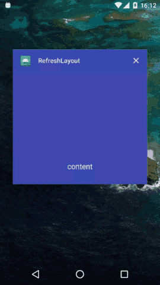

# RefreshLayout
refresh layout demo

## Support functions

+ support ScrollView refresh
+ support RecyclerView refresh
+ support others all view refresh but don't resolve sliding conflict
+ support empty view

## Demo


## Gradle

Step 1. Add the JitPack repository to your build file

Add it in your root build.gradle at the end of repositories:

```groovy
allprojects {
    repositories {
        ...
        maven { url 'https://jitpack.io' }
    }
}
```

Step 2. Add the dependency

```groovy
dependencies {
    implementation 'com.github.onlynight:RefreshLayout:0.5.3'
}
```

## API

```java
/**
 * set refreshing state
 *
 * @param refreshing if set true start refreshing and
 *                   {@link OnRefreshListener#onRefreshing(RefreshLayout)} will be called;
 *                   or stop refreshing.
 */
public void setRefreshing(boolean refreshing);

/**
 * set the header view to show refresh state
 *
 * @param headerView {@link RefreshHeaderView}
 */
public void setHeaderView(RefreshHeaderView headerView);

/**
 * set the empty view.
 * don't use this view's {@link View#setTag(Object)},
 * or the function will not work.
 *
 * @param emptyView
 */
public void setEmptyView(View emptyView);

public void setEmptyView(@LayoutRes int layoutRes);

/**
 * set the empty view visible
 * @param visible
 */
public void setEmptyViewVisible(boolean visible);

/**
 * set refresh function enable
 * @param refreshingEnable
 */
public void setRefreshEnable(boolean refreshingEnable);
```

if you want to check more usage of this lib please check the demo.
